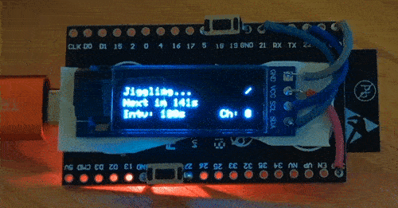

# ESP32 Bluetooth Mouse Jiggler

ESP32 connects to a PC or mobile phone as a bluetooth mouse and jiggles every few seconds to keep the screen alive.

## Features

- OLED Display (status, countdown to next jiggle, configured interval, configured channel/MAC)
- Start/Pause button (short press on upper button)
- Jiggle Interval configurable by button (short press on lower button)
- Use the jiggler on up to three devices (long press on lower button)
- Saves current settings to flash
- Undetectable
- No setup required
- Simple and reliable

## Known limitations

- If bluetooth connection is lost the ESP is restarted because the BLE library does not perform a proper re-init
- Same for changing the bluetooth MAC address

## Parts

- ESP32 NodeMCU
- SSD1306 I2C OLED Display (128x32 pixels)
- 2x push button

## Setup

- Clone the repo.
- Open the repo with VisualStudio Code with PlatformIO installed.
- Press upload button and wait for upload to finish.
- Power your board on
- Connect to bluetooth device

## Credits

Original code by https://github.com/tornado67/DroChill

## License

[MIT](https://choosealicense.com/licenses/mit/)
